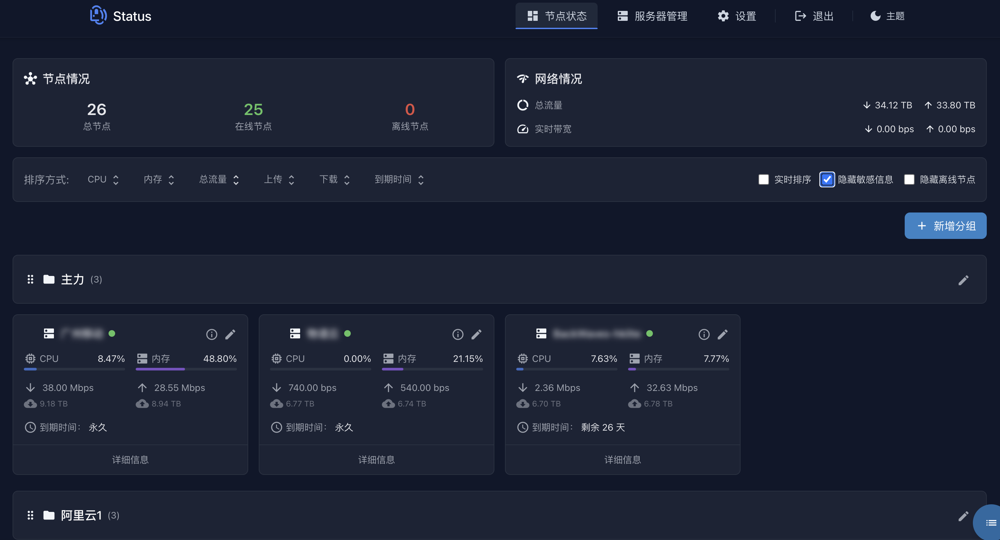
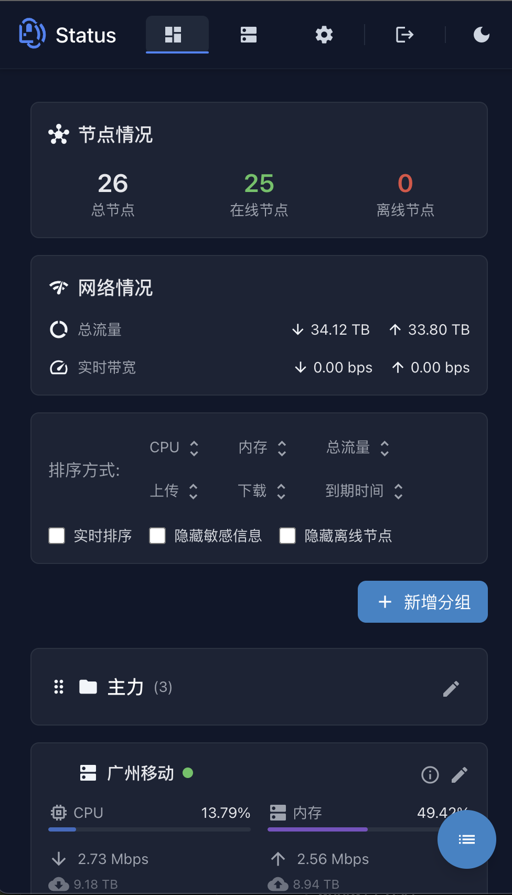

# DStatus

<div align="center">
    
    <p>一个现代化的服务器状态监控面板</p>
</div>

> 🎨 设计理念：简约而不简单，优雅且实用

DStatus 采用现代化的设计语言，将功能性与美观性完美结合。通过 TailwindCSS 实现的响应式界面，为用户带来流畅的监控体验。

## ✨ 设计特点

### 界面设计
- 🎯 简洁直观的卡片式布局
- 🌈 柔和的色彩过渡动画
- 📱 完美适配移动端和桌面端
- 🌙 智能的明暗主题切换
- 📊 优雅的数据可视化

### 交互体验
- ⚡ 流畅的拖拽排序
- 🔄 平滑的状态更新动画
- 👆 直观的触控操作
- 🎯 精确的数据筛选
- 💫 细腻的过渡效果

### 视觉风格
- 📊 清晰的数据层级
- 🎨 舒适的配色方案
- 🔤 优雅的字体排版
- 🖼️ 精致的图标设计
- 📱 响应式布局适配

## 📸 界面预览

<div align="center">
    <table>
        <tr>
            <td align="center">
                <strong>🌙 暗黑模式</strong><br/>
                
            </td>
        </tr>
        <tr>
            <td align="center">
                <strong>📱 移动端视图</strong><br/>
                
            </td>
        </tr>
    </table>
</div>


## 🚀 技术栈

### 后端
- **运行环境**: Node.js (>=12)
- **Web框架**: Express.js
- **数据库**: SQLite3 (better-sqlite3)
- **模板引擎**: Nunjucks
- **WebSocket**: Socket.IO, Express-WS
- **SSH连接**: node-ssh
- **定时任务**: node-schedule
- **通知服务**: node-telegram-bot-api

### 前端
- **UI框架**: TailwindCSS
- **构建工具**: PostCSS
- **拖拽排序**: SortableJS
- **终端模拟**: WebSSH
- **实时更新**: WebSocket

### 开发工具
- **包管理**: npm
- **开发服务**: nodemon
- **CSS处理**: autoprefixer, cssnano
- **并发执行**: concurrently

## 💡 核心功能

### 1. 服务器监控
- ⚡ CPU 使用率实时监控
- 💾 内存占用动态显示
- 🌐 带宽使用实时统计及历史带宽数据
- 📊 流量统计图表展示支持最长12个月
- 💿 硬盘使用情况监控（待实现）


### 2. 分组管理
- 📂 服务器分组创建与编辑
- 🔄 分组拖拽排序
- 👀 分组展开/折叠
- 🏷️ 分组重命名
- 🗑️ 分组删除保护

### 3. 服务器管理
- ➕ 一键添加服务器
- 🔑 SSH密码/密钥认证
- 📋 批量操作功能
- 🔄 状态自动刷新
- 🔍 服务器搜索过滤

### 4. 数据展示
- 📊 多种视图模式（卡片/列表）
- 🌓 自适应暗色模式
- 📱 响应式布局设计
- 🔄 数据实时更新
- 📈 历史数据统计

### 5. 运维功能
- 💻 WebSSH 在线终端
- 📝 常用脚本管理
- 🔔 状态变更通知
- 📥 批量脚本执行（待实现）
- 🔒 安全访问控制

### 6. 通知系统
- 📱 Telegram 机器人通知
- ⚠️ 服务器离线提醒
- 🔔 资源告警通知
- 📊 定期状态报告（待实现）
- 🔕 通知免打扰时段（待实现）

## 🛠️ 快速开始

### Docker 部署（推荐）

1. 克隆项目
```bash
git clone https://github.com/fev125/dstatus.git
cd dstatus
```

2. 构建并启动服务
```bash
# 默认端口：Web管理界面 5555，被控端通信端口 9999
docker-compose up -d

# 如需修改端口，可以通过环境变量指定：
WEB_PORT=8080 CONTROL_PORT=8888 docker-compose up -d

# 查看服务状态
docker-compose ps
```

3. 访问管理面板
- 打开浏览器访问 `http://your-ip:5555`
- 默认管理员密码: `nekonekostatus`
- 首次登录后请立即修改密码

### 目录说明
```
dstatus/
├── database/     # 数据文件目录
│   └── db.db     # SQLite 数据库文件
└── logs/         # 日志目录
    ├── access.log # 访问日志
    └── error.log  # 错误日志
```

### 常用操作命令
```bash
# 查看服务日志
docker-compose logs -f

# 重启服务
docker-compose restart

# 停止服务
docker-compose down

# 更新代码并重新部署
git pull
docker-compose up -d --build
```

### 一键脚本安装

CentOS 7+ / Debian 10+ / Ubuntu 18.04+

```bash
wget https://raw.githubusercontent.com/fev125/dstatus/main/install.sh -O install.sh && bash install.sh
```

### 手动安装

1. 环境要求
   - Node.js 12+
   - gcc/g++ 8.x+
   - git

2. 安装依赖
```bash
# CentOS
yum install epel-release centos-release-scl git nodejs devtoolset-8-gcc* -y

# Debian/Ubuntu
apt update && apt install nodejs npm git build-essential -y
```

3. 克隆代码
```bash
git clone https://github.com/fev125/dstatus.git
cd dstatus
npm install
```

4. 启动服务
```bash
# 直接运行
node dstatus.js

# 使用 PM2
npm install pm2 -g
pm2 start dstatus.js

# 使用 systemd
echo "[Unit]
Description=DStatus
After=network.target

[Service]
Type=simple
Restart=always
RestartSec=5
ExecStart=/path/to/dstatus/dstatus.js

[Install]
WantedBy=multi-user.target" > /etc/systemd/system/dstatus.service

systemctl daemon-reload
systemctl enable dstatus
systemctl start dstatus
```

## ⚙️ 配置说明

### 环境变量
```env
NODE_ENV=production
PORT=5555
SESSION_SECRET=your_session_secret
TELEGRAM_BOT_TOKEN=your_bot_token
```

### 配置文件 (config.js)
```javascript
module.exports = {
  // 服务器配置
  server: {
    port: process.env.PORT || 5555,
    session_secret: process.env.SESSION_SECRET
  },
  
  // 数据库配置
  database: {
    path: './database/db.db'
  },
  
  // Telegram 配置
  telegram: {
    token: process.env.TELEGRAM_BOT_TOKEN,
    chat_id: your_chat_id
  }
}
```

## 📚 API 文档

### 认证接口
- POST `/api/auth/login` - 用户登录
- POST `/api/auth/logout` - 用户登出

### 服务器管理
- GET `/api/servers` - 获取服务器列表
- POST `/api/servers` - 添加服务器
- PUT `/api/servers/:id` - 更新服务器信息
- DELETE `/api/servers/:id` - 删除服务器

### 分组管理
- GET `/api/groups` - 获取分组列表
- POST `/api/groups` - 创建分组
- PUT `/api/groups/:id` - 更新分组
- DELETE `/api/groups/:id` - 删除分组

### 监控数据
- GET `/api/stats/:server_id` - 获取服务器状态
- GET `/api/stats/:server_id/history` - 获取历史数据

## 🔒 安全建议

1. 修改默认密码
2. 使用反向代理（如 Nginx）并启用 HTTPS
3. 配置访问控制
4. 使用 SSH 密钥认证
5. 定期备份数据

## 🤝 贡献指南

1. Fork 本仓库
2. 创建特性分支
3. 提交变更
4. 发起 Pull Request

## 📄 许可证

MIT License

## 🙏 致谢

- 感谢 [NekoNekoStatus](https://github.com/nkeonkeo/nekonekostatus) 项目的启发
- 感谢所有贡献者的付出